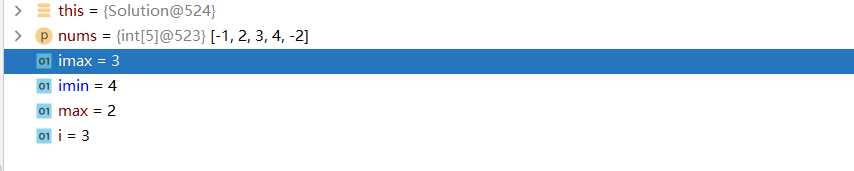

# 刷题心得

​	这份刷题心得是我停止两个月刷题后，发现脑袋里什么都没剩下后，决定要写的。当时刷题，会发现掌握了一个算法的通式或者叫套路以后就可以举一反三，但略微难点的hard题就懵了，所以这次刷题我打算每次做完题目总结一下。

​	心得里写过的算法可以在题目目录下找到对应的解法：

* MySolution：一般是我初见该题写的解法，也有可能是自己写的更容易理解版本的解法。
* Solution:一般是最优解法，也有可能是解出问题的其他方法。
以后leedcode的单周赛和双周赛，哪怕“坐牢”，我也会参加，希望借此多提高提高自己的见识。最后，希望这份刷题心得能给看过的人带来帮助，各位，共勉。

## 二分查找

先介绍一下这个算法，这个算法的核心就是左边界值、右边界值、中间值：

* 先使用左右的边界值得到中间值：pivot=left+(right-left)/2 （这边不用相加除2是因为怕二者相加超过最大长度
* 然后拿目标值和中间值比，中间值大于目标值，则把右边界放到中间值，小于反之，然后重新第一步获取新的中间值。
* 一直重复上面的动作直到获得目标值，或者右边界值大于左边界值才停止。

第704题_二分查找：二分查找（基础题，没任何变形，适合初学和复习）

第278题_第一个错误的版本：第一个错误的版本（基础题，对比查找，这个查找第一个错误的版本，只需要无限查找true和flase的边界直到找到左右两个边汇聚到一个点上，最后返回左边界值即可）

第35题_搜索插入位置：搜索插入位置（基础题，在704题的基础上，不返回中间值了，返回左边界值即可）

## 双指针

双指针其实还可以分为快慢指针和左右指针：

* 快慢指针：主要解决链表中的问题
* 左右指针：主要解决数组或字符串中的问题

第977题_有序数组的平方：创建一个新的数组，然后左指针负责插入最大值。原数组左边为最大值则把左指针右移一位，否则右边左移。

第189题_旋转数组(还不是最优)：新建一个数组，根据输入的k，把原数组按(i+k)%(nums.length)的顺序不断加入新建数组中即可。

## 动态规划

第53题_最大子序和（easy）：这个题的难度在于你要意识到需要最大子序和，需要的是不断的增加，也就是两种情况：

* 当前的数字，前面数字的和大于0，则可以加入最大子序和中。
* 当前的数字，前面数字的和大于0，则去除，取当前数字为新的子序和第一个数字。（任何数加上一个负数，都小于这个数）

第152题_乘积最大子数组（mid）：这个题的难点在于要懂得两点

* 最大值只要和负数相乘就会变成最小值
* 相反，最小值和负数相乘则会成最大值（因为自身为负）

掌握以上两点后，只需要设置一个最大值和最小值，遇到负数的时候，两数交换后再去和这个负数相乘即可。

第1567题_乘积为正数的最长子数组长度（mid）：这题的思路有点类似152题，只不过目的变成了要我们找最长的正数数组。因为乘积为正数的数组有可能含有偶数个负数，也可能没有负数，所以我们需要三个数来保存长度，一个保存负数的长度（imin），一个保存正数长度（imax），一个max保存最长长度。情况就分为了三种：下面拿{-1,2,3,4,-2}打比方

* 遇到的数为负数，那么此时正数的最大长度和最小长度进行互换，负数（imin）长度++，如果正数（imax）大于0，也增大

（例如：上面的数组到了4时，imax为3，imin为4。但到了末尾的-2的时候，由于imax和imin交换，所以此时的max为4，imin为3，最后通过++，最终结果变成imax=5，imin=4）

* 遇到为正数，正数的长度+1，负数如果长度不为0也+1
* 遇到为0，则双方都为0，重新开始计数。

## 

第217题：没什么难度，注意的是这里数据结构用数组会超时，尽量用数据结构为红黑树的hashmap。

第53题：主要是逻辑思考，这里的注意点是，不要去管怎么去相加的，只要注意到相加的时候前面的数的和大于0，那么前面的数就应该加入其中。例如，5,4,-1,7,8，这里的5+4+（-1）>0，那么不用在意-1，因为和大于0，加上7一定是大于7的。

